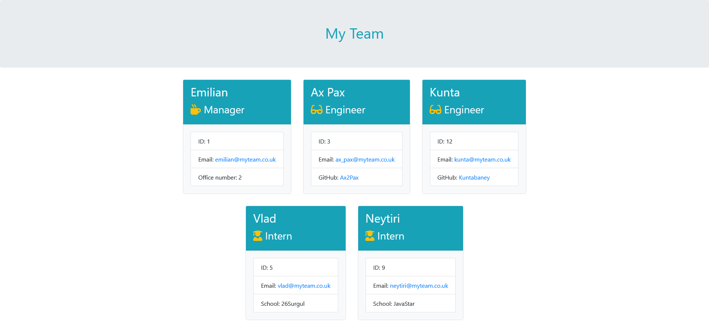

# TEAM PROFILE GENERATOR

## 🚩 TABLE OF CONTENT

- [Description](#-description)
- [Usage](#-usage)
- [Technology used](#-technology-used)
- [Installation](#-installation)
- [Tests](#-tests)
- [Credits](#-credits)
- [Contributing](#-contributing)
- [Questions](#-questions)
- [License](#-license)

## 📖 DESCRIPTION

### 🎯 What is it about?

This command-line application will take in information about employees on a software engineering team, then generates an HTML webpage that displays summaries for each person.

### 🔍 Preview

The following image shows the generated webpage:

## 💻 USAGE

### 💬 User story

`As a manager, I want to generate a webpage that displays my team's basic info so that a user can have quick access to their contact details.`

### 💬 Main functionalities

#### `Inquirer` module

- Based on the tests provided (inside the `starter/__tests__` folder), I created 4 classes - 1 `Employee` parent class and 3 other classes extending that parent class.

- I used the `inquirer` module to prompt the user and gather information about the development team members and creates objects for each team member using the correct classes as blueprints.

#### Classes

- Each employee card is generated based on a class : `Manager`, `Engineer`, `Intern`

- All those 3 classes extend an `Employee` parent class, with a basic structure including a `name`,`email address` and `employee ID`.

- But each class also has unique properties and methods that are not shared with other classes.
  e.g. `Manager` has an `officeNumber` property, `Engineer` has a `github` property and `Intern` has a `school` property.

#### Input validation

- I have implemented basic validation functions to check user inputs (for employee names, IDs, email and Github username). For instance, if an employee name contains characters that are not letters or whitespaces, then they will be prompted again.

#### Generate HTML using `fs` and `path` modules

- After collecting all the data from the user, the application dynamically generates a `team.html` file inside a `output` folder (also dynamically generated) to store the rendered HTML content returned from the `render` function (provided with the starter code).

## 🔌 TECHNOLOGY USED

- Javascript

- Node.js

- Npm

- Html5

- Bootstrap

- Jest 

Apart for some styling adjustments that I've made (cards margins, background and text-color), the HTML content along with the tests files was provided in the starter code.

My task was to write all the JavaScript content necessary to pass the tests and achieve the final goal: generate a webpage based on the user input.

## 🚀 INSTALLATION

To use the app, you will need to:

- install `Node.js`
- run `npm install --save inquirer@^8.0.0` (the app requires version 8 or below)
- run `npm install --save-dev jest`
- then run `node index.js` or `npm start`

## ✅ TESTS

To run the tests, run `npm test` in your terminal.

## 💬 CREDITS

**README template**

- [README file generator](https://github.com/senseilein/readme-file-generator/edit/main/README.md)

**Input validation**

- [Regex101](https://regex101.com/)
- [Email validation Regex](https://www.w3schools.blog/email-validation-javascript-js)
- [Github username validation](https://docs.github.com/en/github-ae@latest/admin/identity-and-access-management/managing-iam-for-your-enterprise/username-considerations-for-external-authentication)

**fs & path modules**

- [How to check if a directory exists](coderrocketfuel.com/article/check-if-a-directory-exists-in-node-js)
- [How to create a directory](https://www.geeksforgeeks.org/node-js-fs-mkdir-method/)
- [Difference between path.resolve and path.join](https://stackoverflow.com/questions/35048686/whats-the-difference-between-path-resolve-and-path-join)

**Thank you**

- This project was made as part of a coding assignment with [Trilogy Education Services](https://skillsforlife.edx.org/)

## ✨ CONTRIBUTING

All contributions are welcome. Please feel free to contact me (using the contact details in the Questions section) or open an issue on this repository.

## ❔ QUESTIONS

- If you have any questions, [please click here to send me an email.](mailto:senseilein@protonmail.com)
- You can also visit my Github profile [@senseilein](https://github.com/senseilein).

## 📃 LICENSE

This application is covered under MIT License.
